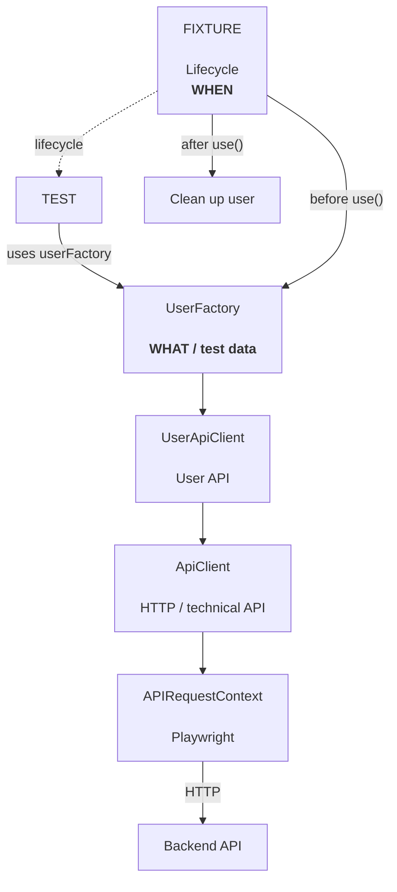

## Algemene architectuur

| Laag            | Verantwoordelijkheid                                            |
| --------------- | --------------------------------------------------------------- |
| **Page Object** | UI-interactie + validatie van expliciete toestandsveranderingen |
| **Workflow**    | Meerdere Page Objects combineren tot een gebruikersproces       |
| **Test**        | Bepaalt wat het proces uiteindelijk moet bewijzen               |

| Onderdeel   | Verantwoordelijkheid                         |
| ----------- | -------------------------------------------- |
| Test        | **Wat** wil ik testen?                       |
| UserFactory | **Welke user** moet ik creëren?              |
| API Client  | **Hoe communiceer ik technisch met de API?** |
| Page Object | **Hoe communiceer ik met de UI?**            |
| Workflow    | **Welke business flow voer ik uit?**         |

## API + UI test architecture



### Responsibilities

| Component             | Responsibility                                        |
| --------------------- | ----------------------------------------------------- |
| **Test**              | Defines **what** is being tested                      |
| **Fixture**           | Controls **when** test data is created and cleaned up |
| **UserFactory**       | Defines **what kind of test user** is needed          |
| **UserApiClient**     | Provides user-specific API operations                 |
| **ApiClient**         | Handles generic HTTP/API communication                |
| **APIRequestContext** | Playwright mechanism for executing API requests       |
| **Backend API**       | Creates and manages the actual application data       |

### Fixture lifecycle

The fixture controls the lifetime of the test user:

```text
Before use()
    ↓
Create user through UserFactory
    ↓
await use(customer)
    ↓
Test executes
    ↓
After use()
    ↓
Delete / clean up user
```

### Dependency flow

```text
Test
  ↓
UserFactory
  ↓
UserApiClient
  ↓
ApiClient
  ↓
APIRequestContext
  ↓
Backend API
```

The important distinction is:

* **Fixture = WHEN** → controls lifecycle
* **UserFactory = WHAT** → defines the required test data
* **UserApiClient = DOMAIN API** → knows how to perform user-related API operations
* **ApiClient = HOW** → handles generic HTTP communication
* **APIRequestContext = EXECUTION** → performs the actual API request

```

**Deze zou ik voor je README gebruiken.** Vooral de combinatie van het Mermaid-diagram en de korte lifecycle-flow maakt het voor iemand die je repo bekijkt meteen duidelijk waarom die verschillende lagen bestaan.

Als je wilt, kunnen we hem later in hoofdstuk 8 ook uitbreiden naar één **volledig architectuurdiagram van jouw hele Playwright-project** (Test → Fixtures → Workflows → Page Objects → API → Backend).
```

                 

