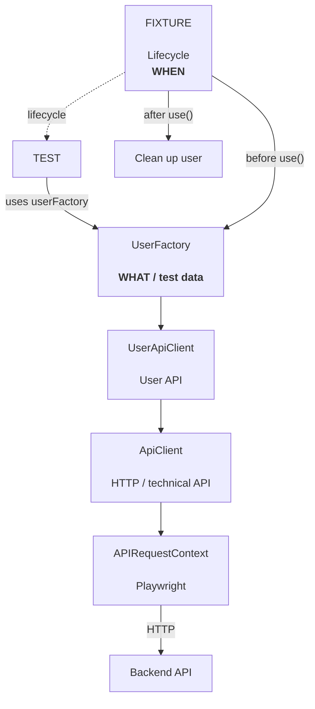

## Algemene architectuur

| Laag            | Verantwoordelijkheid                                            |
| --------------- | --------------------------------------------------------------- |
| **Page Object** | UI-interactie + validatie van expliciete toestandsveranderingen |
| **Workflow**    | Meerdere Page Objects combineren tot een gebruikersproces       |
| **Test**        | Bepaalt wat het proces uiteindelijk moet bewijzen               |

| Onderdeel   | Verantwoordelijkheid                         |
| ----------- | -------------------------------------------- |
| Test        | **Wat** wil ik testen?                       |
| UserFactory | **Welke user** moet ik creëren?              |
| API Client  | **Hoe communiceer ik technisch met de API?** |
| Page Object | **Hoe communiceer ik met de UI?**            |
| Workflow    | **Welke business flow voer ik uit?**         |

## API + UI test architecture



### Responsibilities

| Component             | Responsibility                                        |
| --------------------- | ----------------------------------------------------- |
| **Test**              | Defines **what** is being tested                      |
| **Fixture**           | Controls **when** test data is created and cleaned up |
| **UserFactory**       | Defines **what kind of test user** is needed          |
| **UserApiClient**     | Provides user-specific API operations                 |
| **ApiClient**         | Handles generic HTTP/API communication                |
| **APIRequestContext** | Playwright mechanism for executing API requests       |
| **Backend API**       | Creates and manages the actual application data       |

### Fixture lifecycle

The fixture controls the lifetime of the test user:

```text
Before use()
    ↓
Create user through UserFactory
    ↓
await use(customer)
    ↓
Test executes
    ↓
After use()
    ↓
Delete / clean up user
```

### Dependency flow

```text
Test
  ↓
UserFactory
  ↓
UserApiClient
  ↓
ApiClient
  ↓
APIRequestContext
  ↓
Backend API
```

The important distinction is:

* **Fixture = WHEN** → controls lifecycle
* **UserFactory = WHAT** → defines the required test data
* **UserApiClient = DOMAIN API** → knows how to perform user-related API operations
* **ApiClient = HOW** → handles generic HTTP communication
* **APIRequestContext = EXECUTION** → performs the actual API request


###Good to know

##Locators:
```text
Auto-waiting covers actions on a single element, but some situations need
an explicit wait first:

- waitForLoadSState() Wait for 'load', 'domcontentloaded', or 'networkidle' after navigation
- waitForSelector() Wait for an element to appear/disappear before proceeding
- waitForResponse() Wait for a specific network response (e.g. after an API call) 
```

##Assertions:
```text
- Web-First 
await expect(locator).toBeVisible();
Targets a locator, auto retries until it passes or times out.
Use this when it's derived from a page

- Generic 
expect(responseBody.status).toBe(200);
Targets a plain value, checked once immediately, no retry
(API response, computed number)

- Soft assertion
await expect.soft()
Records the failure but let the test keep running (Test is marked failed)
```

##Annotations:
```text
test.skip() Don't run this test, reported as skipped
test.only() Run only this test in the file (for debugging purposes)
test.fixme() Marks a known broken test, skipped but tracked
test.slow() Triples the timeout for a known slow test
```

##Example test file:
```text
test.describe('Profile settings', { tag: '@smoke' }, () => {
  test.beforeEach(async ({ page }) => {
    await page.goto('/profile');
  })

  test('updates display name', async ({ page}) => {
    const name = faker.person.fullName();
    await test.step('fill and submit form', async () => {
      await page.getByLabel('Display name').fill(name);
      await page.getByRole('button', { name: 'Save' }).click()
    })
    await expect.soft(page.getByText('Saved!')).toBeVisible();
    await expect(page.getByLabel('Display name')).toHaveValue(name);
  })
})
```

##Example LoginPage Class:
```text
export class LoginPage { 
  readonly page: Page;
  readonly emailInput: Locator
  readonly passwordInput: Locator
  readonly signInButton: Locator

  constructor(page: Page) {
    this.page = page;
    this.emailInput = page.getByLabel('Email');
    this.passwordInput = page.getByLabel('Password');
    this.signInButton = page.getByRole('button', { name: 'Sign in' });
  }

  async goto() {
    await this.page.goto('/login');
  }

  async signIn(email: string, password: string) {
    await this.emailInput.fill(email);
    await this.passwordInput.fill(password);
    await this.signInButton.click();
  }
}
```

!! Keep assertions OUT of page objects. Return locators/values, assert in the test !!

##Fixtures:
```text
import { test as base } from '@playwright/test';
import { LoginPage } from '../pages/LoginPage';

export const test = base.extend<{ loginPage: LoginPage }> ({
  loginPage: async ({ page }, use) => {
    await use(new LoginPage(page));
  }
});
```

##Using a custom fixture:
```text
import { test } from '../fixtures';
import { expect } from '@playwright/test';

test('user can log in', async ({ loginPage, page }) => {
  await loginPage.goto();
  await loginPage.signIn('user@example.com', 'Secret!');
  await expect(page.getByText('Welcome back')).toBeVisible();
});
```

##Combining multiple Page Objects
```text
type Pages = { loginPAge: LoginPage, dashboardPage: DashboardPage };

export const test = base.extend<Pages>({
  loginPage: async ({ page }, use) => { await use(new LoginPage(page)); },
  dashboardPage: async ({ page }, use) => { await use(new DashboardPage(page)); }
});

And in a test:
test('...', async ({ loginPage, dashboardPage }) => { /* ... */ });
```

Every page object your suite needs become a fixture, injected only when a test actually asks for it.
Playwright resolves and caches them lazily per test.
                 

